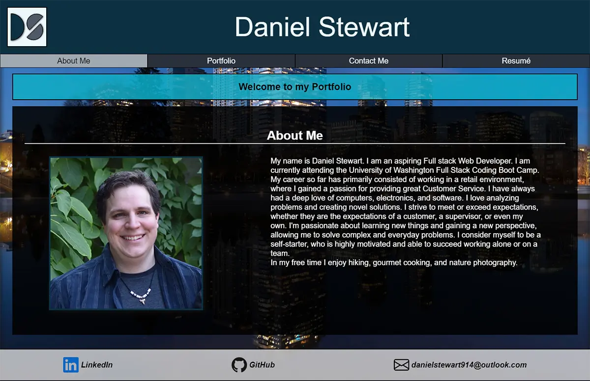

# Daniel Stewart's Portfolio - 
## Description

A simple React based Portfolio for Homework assignment.

## My Favorite Things

I enjoy being creative and wanted to shout out my favorite parts of this project.

* I created a hand coded SVG for my personal logo based on an initial draft logo created I in draw.io to use as a favicon.
* Created a simple command line tool for adding additional Projects to my portfolio simply by answering a few prompts from inquirer.

### Deployed Application
Click [Here](https://danielstewart914.github.io/react-portfolio/) or on the image below to view my Portfolio.

## Table of Contents

- [License](#license)
- [Technology](#technology)
- [Questions](#questions)

## License

MIT License

Copyright 2022 &copy; Daniel Stewart

Permission is hereby granted, free of charge, to any person obtaining a copy of this software and associated documentation files (the "Software"), to deal in the Software without restriction, including without limitation the rights to use, copy, modify, merge, publish, distribute, sublicense, and/or sell copies of the Software, and to permit persons to whom the Software is furnished to do so, subject to the following conditions:

The above copyright notice and this permission notice shall be included in all copies or substantial portions of the Software.

THE SOFTWARE IS PROVIDED "AS IS", WITHOUT WARRANTY OF ANY KIND, EXPRESS OR IMPLIED, INCLUDING BUT NOT LIMITED TO THE WARRANTIES OF MERCHANTABILITY, FITNESS FOR A PARTICULAR PURPOSE AND NONINFRINGEMENT. IN NO EVENT SHALL THE AUTHORS OR COPYRIGHT HOLDERS BE LIABLE FOR ANY CLAIM, DAMAGES OR OTHER LIABILITY, WHETHER IN AN ACTION OF CONTRACT, TORT OR OTHERWISE, ARISING FROM, OUT OF OR IN CONNECTION WITH THE SOFTWARE OR THE USE OR OTHER DEALINGS IN THE SOFTWARE.

## Technology

### Languages

- 

### Packages

- 

- ### Client

- 

### Development

-  (For Adding Projects to Portfolio)
## Questions 

If you have any questions or feedback you can contact me through one of the links below  
GitHub Profile - [danielstewart914](https://github.com/danielstewart914) 
Email - [danielstewart914@outlook.com](mailto:danielstewart914@outlook.com)
